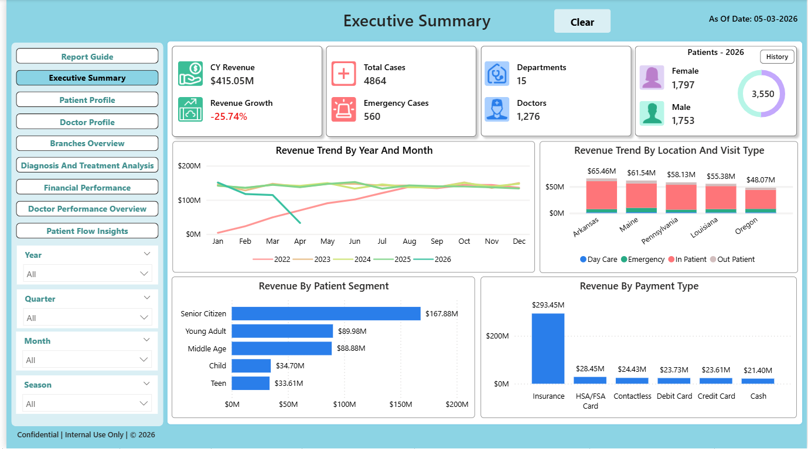
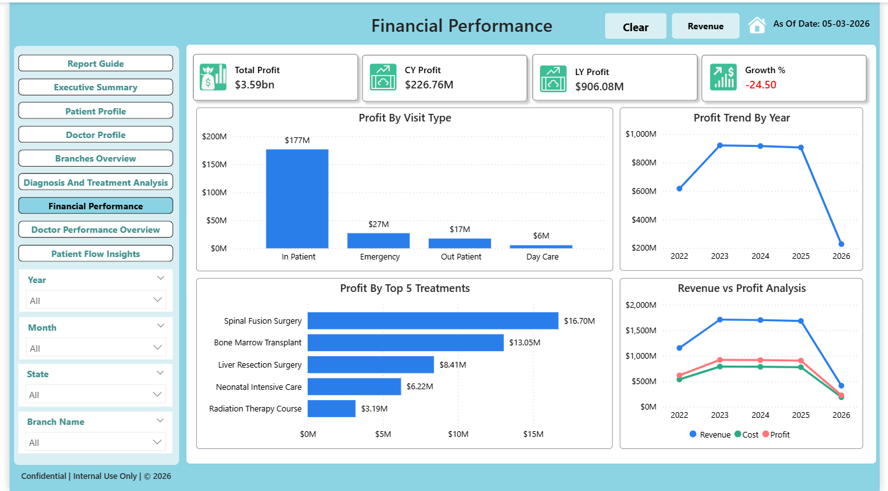
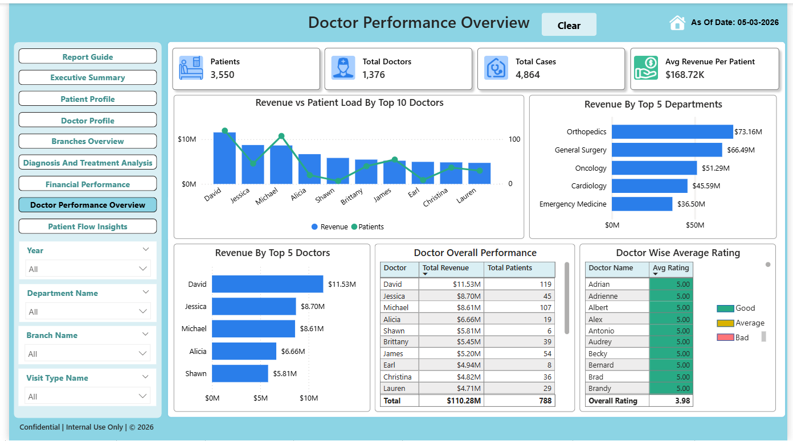
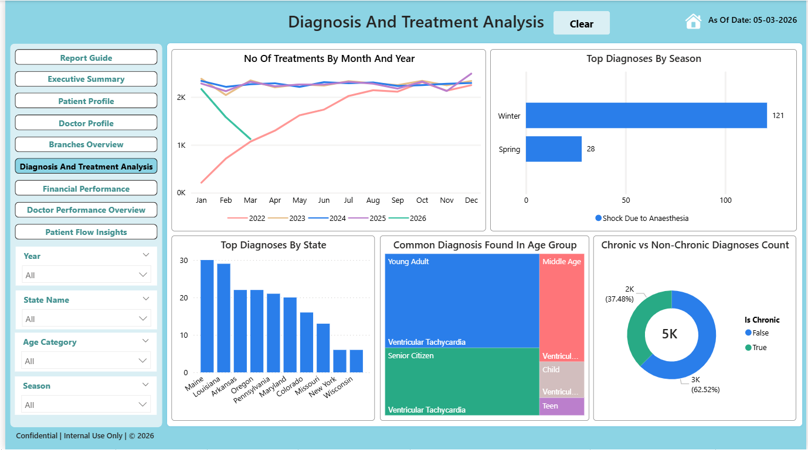
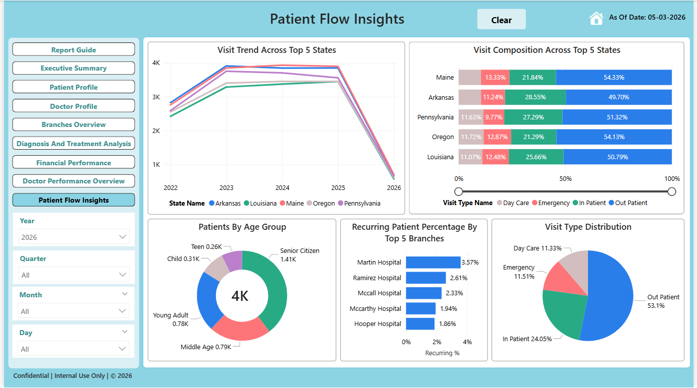
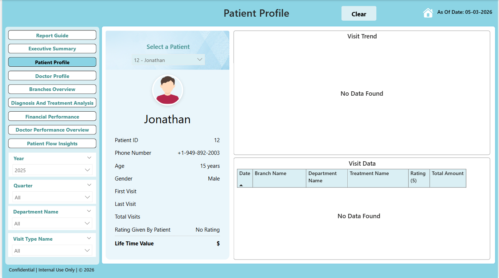
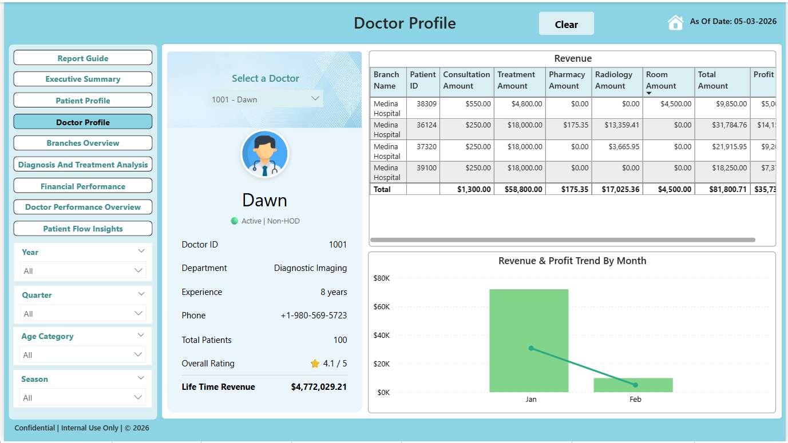

# Hospital Management Analytics System


---

# Overview

This repository contains an end-to-end healthcare analytics and data warehousing system built using SQL Server, Python, dimensional modeling, and Power BI.

The project simulates a real-world hospital environment by generating synthetic operational data, designing an OLTP database, building a star schema-based analytical warehouse, and creating interactive Power BI dashboards for business reporting and operational analysis.

The system was designed to demonstrate the complete analytics workflow:

```text
Synthetic Data Generation
        ↓
OLTP Database Design
        ↓
ETL Pipeline
        ↓
Star Schema Data Warehouse
        ↓
Power BI Analytics & Reporting
```

Unlike dashboard-only portfolio projects, this repository focuses on the full analytics engineering lifecycle.

---

# Project Objectives

The project was built to:

* Simulate real-world hospital operations using synthetic healthcare data
* Design a normalized operational database system
* Build a dimensional data warehouse for analytical reporting
* Implement ETL workflows using Python
* Create business-focused Power BI dashboards
* Analyze revenue, patient flow, doctor performance, and diagnosis trends
* Demonstrate SQL + Python + Power BI integration in a complete analytics pipeline

---

# Tech Stack

| Layer           | Technology                             |
| --------------- | -------------------------------------- |
| Database        | SQL Server                             |
| SQL IDE         | SQL Server Management Studio (SSMS 19) |
| Data Generation | Python + Faker                         |
| ETL Pipeline    | Python                                 |
| Data Warehouse  | Star Schema Modeling                   |
| Visualization   | Power BI                               |
| Version Control | Git + GitHub                           |

---

# System Architecture

```text
Python Faker Data Generation
            ↓
     SQL Server OLTP Database
            ↓
      Python ETL Pipeline
            ↓
     Star Schema Warehouse
            ↓
      Power BI Dashboards
```

---

# OLTP Database Design

The operational database was designed to simulate real-world hospital transactions and workflows.

## Major Entities

* State
* City
* Hospital Branch
* Department
* Specialization
* Doctor
* Patient
* Appointment
* Treatment
* Visit Type
* Billing
* Pharmacy Items
* Pharmacy Billing Details
* Radiology Services
* Radiology Billing Details

The OLTP layer was designed using relational modeling principles with structured relationships and constraints.

---

# Synthetic Data Generation

Synthetic healthcare data was generated using Python and the Faker library.

## Data Generation Features

* Randomized patient records
* Doctor and specialization mapping
* Appointment generation
* Billing transactions
* Branch-wise data generation
* City and state mapping
* Treatment and diagnosis simulation
* Healthcare visit simulation

## Scale

* 200K+ patient visits generated
* Multi-entity healthcare dataset
* Analytical reporting-ready data

---

# ETL Pipeline

The ETL layer was implemented using Python scripts.

## ETL Responsibilities

* Extracting OLTP data
* Data transformation
* Loading dimension tables
* Loading fact tables
* Data standardization
* Warehouse population

## Warehouse Components

### Fact Tables

* Fact Visit
* Fact Billing

### Dimension Tables

* Dim Date
* Dim Doctor
* Dim Patient
* Dim Branch
* Dim Treatment
* Dim Visit Type
* Dim Appointment Type
* Dim Payment Type

---

# Star Schema Design

The analytical warehouse was modeled using a star schema architecture optimized for reporting and business intelligence.

## Included Assets

* Star Schema Diagram
* Dimensional Model
* OLAP Design
* Fact and Dimension Relationships

---

# Dashboard Showcase

> Dashboard screenshots should be stored inside:
>
> ```text
> 05_PowerBI_Dashboard/Dashboard_Screenshots/
> ```
>
> Recommended screenshot naming:
>
> ```text
> Executive_Summary_Dashboard.png
> Financial_Performance_Revenue.png
> Financial_Performance_Profit.png
> Doctor_Performance_Overview.png
> Diagnosis_Treatment_Analysis.png
> Patient_Flow_Insights.png
> Patient_Profile_Dashboard.png
> Doctor_Profile_Dashboard.png
> ```

---

## Executive Summary Dashboard



---

## Financial Performance Dashboard




---

## Doctor Performance Overview



---

## Diagnosis & Treatment Analysis



---

## Patient Flow Insights



---

## Patient Profile Dashboard



---

## Doctor Profile Dashboard



---

# Power BI Dashboards

The Power BI layer contains 8 analytical dashboards designed for executive reporting, operational monitoring, and healthcare analytics.

---

## 1. Executive Summary Dashboard

### Business Focus

Provides a high-level overview of:

* Revenue trends
* Growth analysis
* Patient segmentation
* Branch performance
* Payment analysis
* State-wise performance

### Key Questions Answered

* What is the overall revenue trend?
* Which locations generate the highest revenue?
* Which patient segments contribute most financially?
* How is revenue changing year-over-year?

---

## 2. Financial Performance – Revenue Dashboard

### Business Focus

Analyzes revenue generation across treatments, visit types, and healthcare services.

### Key Questions Answered

* Which treatments generate the highest revenue?
* Which departments contribute most financially?
* How does revenue change over time?
* Which services drive hospital income?

---

## 3. Financial Performance – Profit Dashboard

### Business Focus

Analyzes profitability across services and hospital operations.

### Key Questions Answered

* Which treatments are most profitable?
* Which visit types generate better margins?
* How is yearly profit changing?
* Which operational areas underperform financially?

---

## 4. Doctor Performance Overview

### Business Focus

Tracks doctor-level operational and financial performance.

### Key Questions Answered

* Which doctors generate the highest revenue?
* Which doctors handle the highest patient volume?
* Which departments perform best operationally?
* How do ratings compare across doctors?

---

## 5. Diagnosis & Treatment Analysis

### Business Focus

Analyzes diagnosis trends, treatment behavior, and healthcare patterns.

### Key Questions Answered

* Which diagnoses are most common?
* Which age groups are associated with specific diagnoses?
* How do diagnosis trends vary over time?
* Which regions show higher diagnosis counts?

---

## 6. Patient Flow Insights

### Business Focus

Analyzes patient movement, utilization trends, and recurring visits.

### Key Questions Answered

* Which branches experience the highest patient traffic?
* What are the most common visit types?
* Which age groups dominate hospital visits?
* How does patient flow change over time?

---

## 7. Patient Profile Dashboard

### Business Focus

Provides patient-level analytical insights.

### Key Questions Answered

* What is the patient visit history?
* Which treatments has the patient received?
* What is the patient lifetime value?
* How frequently does the patient visit the hospital?

---

## 8. Doctor Profile Dashboard

### Business Focus

Provides detailed doctor-level analytics.

### Key Questions Answered

* How much revenue does a doctor generate?
* What is the doctor’s patient volume?
* Which specializations perform best?
* How does doctor performance trend over time?

---

# DAX Measures

The Power BI dashboards use custom DAX measures for KPI calculation and analytical reporting.

## Example Measures

### Revenue Growth %

```DAX
Revenue Growth % =
DIVIDE(
    TOTALYTD(SUM('Fact Billing'[Total Amount]), 'Dim Date'[Full Date])
    -
    CALCULATE(
        TOTALYTD(SUM('Fact Billing'[Total Amount]),'Dim Date'[Full Date]),
        SAMEPERIODLASTYEAR('Dim Date'[Full Date])
    ),
    CALCULATE(
        TOTALYTD(SUM('Fact Billing'[Total Amount]), 'Dim Date'[Full Date]),
        SAMEPERIODLASTYEAR('Dim Date'[Full Date])
    ),
    0
)
```

### Avg Revenue Per Patient

```DAX
Avg Revenue Per Patient =
DIVIDE(
    SUM('Fact Billing'[Total Amount]),
    DISTINCTCOUNT('Fact Billing'[Patient Key])
)
```

Additional measures are available inside the `DAX_Measures` folder.

---

# Repository Structure

```text
Hospital-data-analytics/
│
├── 01_OLTP_Database/
│
├── 02_Data_Generation/
│   ├── Python_Scripts/
│   ├── Faker_Setup/
│   └── Generated_Data/
│
├── 03_ETL_Pipeline/
│   ├── ETL_Scripts/
│   └── Transformation_Logic/
│
├── 04_Data_Warehouse/
│   ├── OLAP_Scripts/
│   └── Star_Schema/
│
├── 05_PowerBI_Dashboard/
│   ├── PBIX_File/
│   ├── Dashboard_Screenshots/
│   └── DAX_Measures/
│
├── 06_Documentation/
│   ├── ER_Diagram/
│   ├── Architecture_Diagram/
│   └── Project_Documentation/
│
└── README.md
```

---

# Setup Instructions

This section is mandatory for reproducibility and recruiter credibility.

The goal is to allow another developer or recruiter to understand how the system is structured and how the analytics pipeline works.

---

## 1. Clone Repository

```bash
git clone https://github.com/your-username/Hospital-data-analytics.git
```

---

## 2. Setup SQL Server Database

* Open SQL Server Management Studio
* Execute OLTP table creation scripts
* Create required database objects

---

## 3. Run Data Generation Scripts

Install dependencies:

```bash
pip install faker pandas pyodbc
```

Run Python data generation scripts.

---

## 4. Execute ETL Pipeline

Run ETL scripts to populate:

* Fact tables
* Dimension tables
* Analytical warehouse

---

## 5. Open Power BI File

Open:

```text
05_PowerBI_Dashboard/PBIX_File/
```

Load:

```text
Hospital_Management_Analytics.pbix
```

Refresh data connections if required.

---

# Key Features

* End-to-end analytics workflow
* Synthetic healthcare data generation
* OLTP relational database design
* Star schema dimensional modeling
* ETL pipeline implementation
* Interactive Power BI dashboards
* KPI-driven business reporting
* Revenue and profitability analysis
* Operational healthcare analytics

---

# Future Improvements

Potential future enhancements:

* Real-time streaming analytics
* Cloud warehouse deployment
* Role-level security implementation
* Forecasting and predictive analytics
* Patient risk scoring
* Incremental data refresh
* Azure/Snowflake integration
* Advanced healthcare KPI monitoring

---

# Project Highlights

* 200K+ simulated patient visits
* 8 analytical dashboards
* Python-based ETL pipeline
* SQL Server OLTP database
* Star schema data warehouse
* Power BI reporting system
* Custom DAX measures
* End-to-end healthcare analytics architecture

---

# Author

Developed as a self-driven healthcare analytics engineering project focused on:

* Data Engineering
* Data Warehousing
* Business Intelligence
* SQL Development
* Healthcare Analytics
* Power BI Reporting

---

# License

This project is intended for educational and portfolio purposes.
